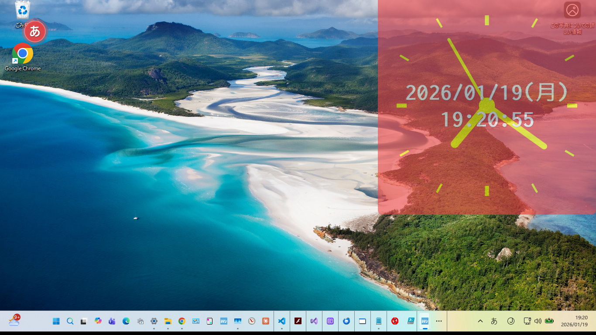
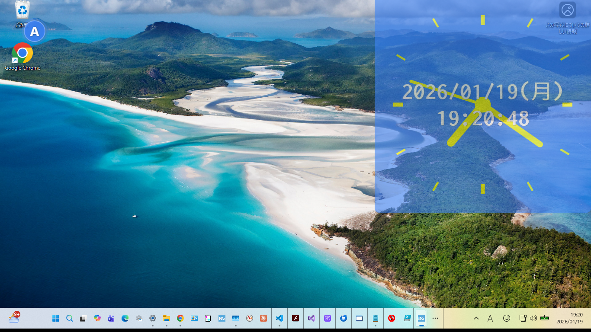
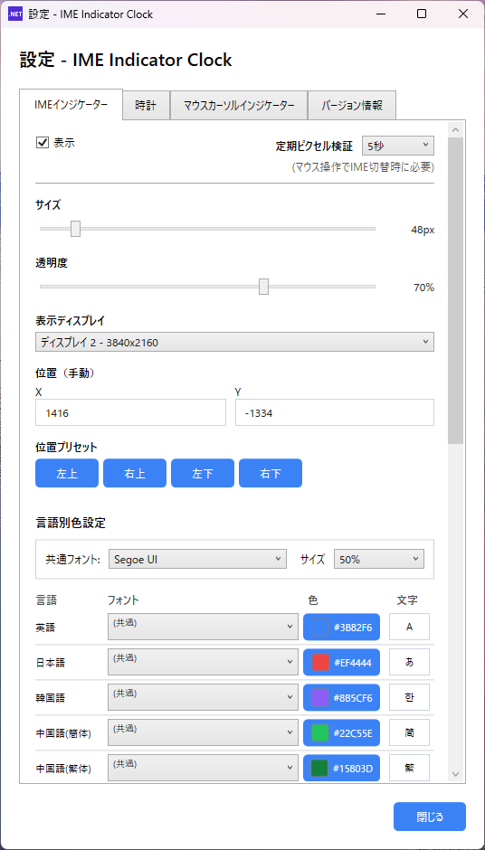
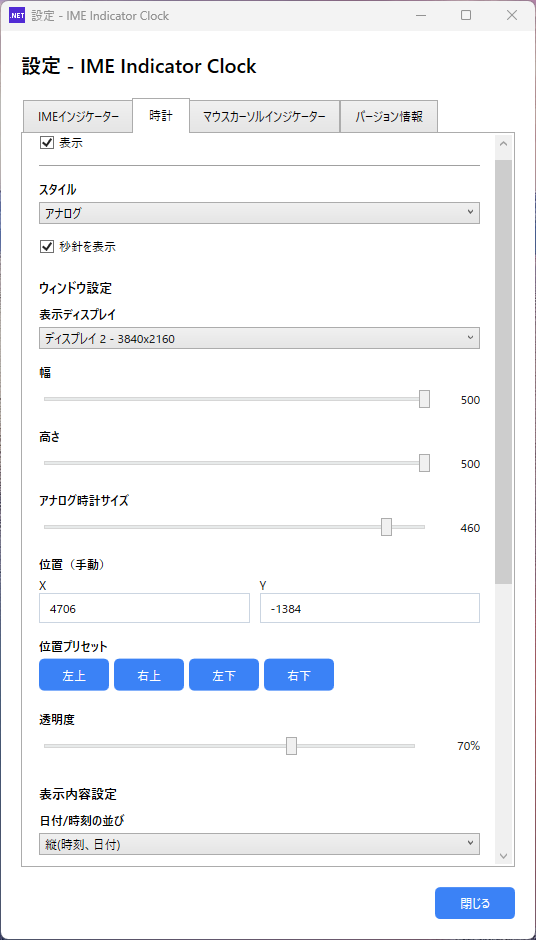
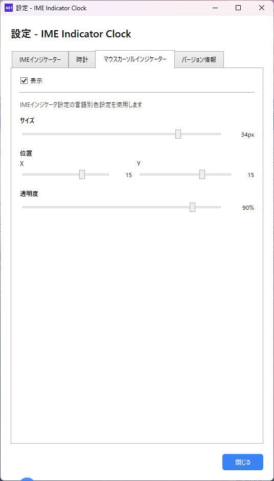
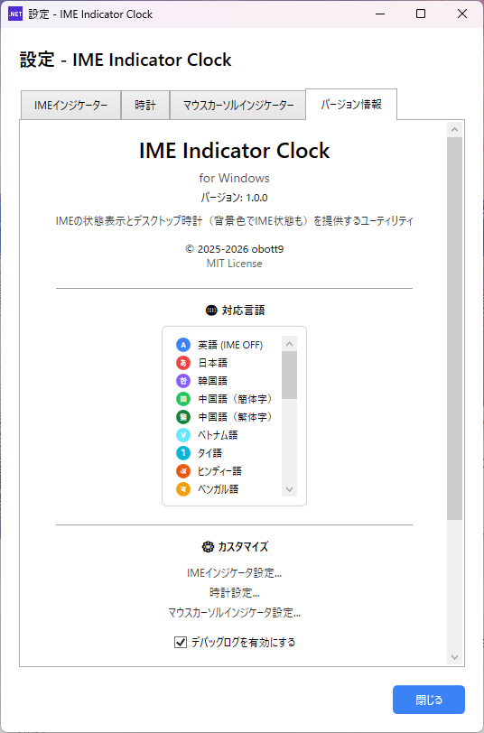

# IMEIndicatorClockW

[English](README.md) | [日本語](README_ja.md) | [繁體中文](README_zh-Hant.md) | [简体中文](README_zh-Hans.md)

IME(입력기) 상태를 시각적으로 표시하고 사용자 정의 가능한 데스크톱 시계를 제공하는 Windows 유틸리티 앱입니다.

macOS 버전 [IMEIndicatorClock](https://github.com/obott9/IMEIndicatorClock)의 Windows 포팅 버전입니다.

## 스크린샷

### 데스크톱 미리보기
| IME 켜짐 (일본어) | IME 꺼짐 (영어) |
|:----------------:|:---------------:|
|  |  |

### 설정 화면
| IME 인디케이터 | 시계 | 마우스 커서 | 버전 |
|:-------------:|:----:|:----------:|:----:|
|  |  |  |  |

## 비전

**우리의 목표는 전 세계의 IME를 지원하는 것입니다.**

IME를 사용하는 사용자가 현재 입력 모드를 한눈에 확인할 수 있도록 돕는 것을 목표로 합니다.

## 기능

### IME 표시기
- 화면에 현재 입력기 상태를 시각적으로 표시
- 일본어 입력: 빨간 원에 "あ"
- 영어 입력: 파란 원에 "A"
- 위치, 크기, 투명도 사용자 정의 가능
- 멀티 디스플레이 지원

### 데스크톱 시계
- 아날로그 및 디지털 모드를 지원하는 플로팅 시계
- 날짜 표시 지원 (일본 연호 지원)
- IME 상태에 따른 배경색 전환 기능
- 창 크기, 글꼴 크기, 색상을 자유롭게 사용자 정의

### 마우스 커서 표시기
- 마우스 커서 근처에 IME 상태를 표시
- 텍스트 입력 시 편리

## 언어 지원

### 완전 지원 (IME 감지 + UI)
| 언어 | IME 감지 | UI 번역 |
|------|:--------:|:-------:|
| 일본어 | ✅ | ✅ |
| 영어 | ✅ | ✅ |
| 중국어(간체) | ✅ | ✅ |
| 중국어(번체) | ✅ | ✅ |
| 한국어 | ✅ | ✅ |

### IME 감지 + 기본 UI
| 언어 | IME 감지 | UI 번역 |
|------|:--------:|:-------:|
| 태국어 | ✅ | ✅ |
| 베트남어 | ✅ | ✅ |
| 아랍어 | ✅ | ✅ |
| 히브리어 | ✅ | ✅ |
| 힌디어 | ✅ | ✅ |
| 러시아어 | ✅ | ✅ |
| 그리스어 | ✅ | ✅ |
| 벵골어 | ✅ | ✅ |
| 타밀어 | ✅ | ✅ |
| 텔루구어 | ✅ | ✅ |
| 네팔어 | ✅ | ✅ |
| 싱할라어 | ✅ | ✅ |
| 미얀마어 | ✅ | ✅ |
| 크메르어 | ✅ | ✅ |
| 라오어 | ✅ | ✅ |
| 몽골어 | ✅ | ✅ |
| 페르시아어 | ✅ | ✅ |
| 우크라이나어 | ✅ | ✅ |

*이러한 언어의 UI 번역은 기계 번역으로, 개선이 필요할 수 있습니다. 기여를 환영합니다!*

## 시스템 요구 사항

- Windows 10/11
- .NET 8.0 Runtime

## 설치

1. [Releases](https://github.com/obott9/IMEIndicatorClockW/releases)에서 최신 버전 다운로드
2. 원하는 폴더에 압축 해제
3. `IMEIndicatorW.exe` 실행

## 소스에서 빌드

### 요구 사항
- Visual Studio 2022 또는 VS Code
- .NET 8.0 SDK

### 빌드 단계
```bash
git clone https://github.com/obott9/IMEIndicatorClockW.git
cd IMEIndicatorClockW
dotnet build
```

## 사용 방법

1. 앱을 실행하면 시스템 트레이에 아이콘이 나타납니다
2. 트레이 아이콘을 우클릭하여 설정에 접근
3. 시계나 표시기를 원하는 위치로 드래그

## 보안 및 개인정보

### 키보드 후킹 사용에 대하여

본 애플리케이션은 정확한 IME 상태 감지를 위해 **저수준 키보드 후킹**(`SetWindowsHookEx` API)을 사용합니다.

**키보드 후킹이 필요한 이유:**
- Windows 표준 IME API만으로는 일부 애플리케이션(터미널, 게임 등)에서 IME 상태를 정확히 얻을 수 없습니다
- 키보드 후킹으로 IME 전환 키(한/영, 한자 등)의 입력을 감지하여 더 정확한 상태 표시를 구현합니다

**안전성:**
- 키 입력 내용은 **절대 기록하거나 전송하지 않습니다**
- IME 관련 키(한/영, Ctrl+Space 등)만 감지합니다
- 인터넷 통신 기능이 없습니다
- 설정 데이터는 로컬(`%AppData%\IMEIndicatorW`)에만 저장됩니다
- 소스 코드가 공개되어 있어 동작을 확인할 수 있습니다

**백신 소프트웨어 경고에 대하여:**
키보드 후킹을 사용하는 애플리케이션은 백신 소프트웨어에서 경고를 받을 수 있습니다. 이는 키로거 등과 동일한 기술을 사용하기 때문이지만, 본 애플리케이션은 악의적인 동작을 수행하지 않습니다. 우려되시면 소스 코드를 확인해 주세요.

## 개발

이 프로젝트는 Anthropic의 [Claude AI](https://claude.ai/)와 공동 개발되었습니다.

Claude가 지원한 부분:
- 아키텍처 설계 및 코드 구현
- 다국어 현지화
- 문서 및 README 작성

## 지원

이 앱이 유용하다면 커피 한 잔 사주세요!

[](https://ko-fi.com/obott9)

## 기여

기여를 환영합니다! 특히:
- 추가 언어의 UI 번역
- 더 많은 IME 유형 지원
- 버그 보고 및 기능 요청

## 라이선스

MIT License - 자세한 내용은 [LICENSE](LICENSE) 파일을 참조하세요.
